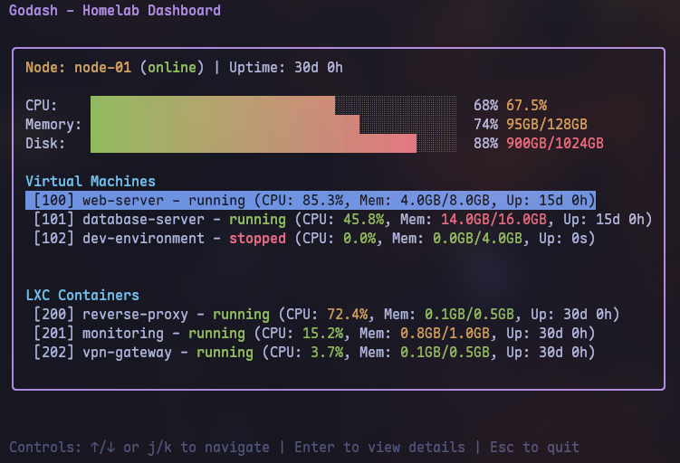
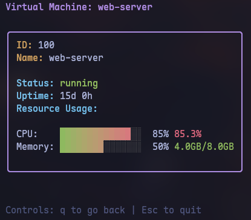
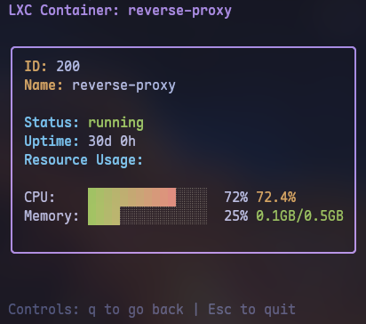

# Godash

A terminal-based dashboard for monitoring and managing Proxmox VMs, containers, and services.

## Status

**In Development** - Phase 1: UI Foundation

## Features (Planned)

- Real-time Proxmox node and VM monitoring
- Docker container visibility across VMs
- Intelligent update management with changelog awareness
- Interactive TUI with keyboard navigation

## Screenshots



 &nbsp;&nbsp;&nbsp; 

## Development Setup

### Prerequisites

- [distrobox](https://github.com/89luca89/distrobox) installed
- podman or docker as container runtime

### Quick Start

```bash
# Clone the repository
git clone https://github.com/yourusername/godash.git
cd godash

# Set up development environment
./scripts/setup-dev-env.sh

# Enter the container
distrobox enter godash-dev

# Run the project
cd ~/projects/godash
go run cmd/godash/main.go
```

### Custom Container Name

If you already have a container named `godash-dev`:
```bash
./scripts/setup-dev-env.sh my-custom-name
distrobox enter my-custom-name
```

## Building

```bash
go build -o bin/godash cmd/godash/main.go
```

## Project Structure

```
godash/
├── cmd/godash/         # Main application entry point
├── internal/           # Private application code
│   ├── app/            # Application state and coordination
│   ├── config/         # Configuration management
│   ├── models/         # Data models
│   └── ui/             # TUI components
├── configs/            # Configuration files
├── scripts/            # Development scripts
└── testdata/           # Test fixtures
